[← Index](../../index.md)

# fichas.doc

**1\. Completa el crucigrama con el nombre de las frutas**

  

  
|  5 |    
|    
|    
|    
|    
|    
|  11 |    
|    
|    
|  14  
---|---|---|---|---|---|---|---|---|---|---|---|---  
  
|    
|    
|    
|    
|    
|    
|    
|    
|    
|  12 |    
|  el limón la manzana el plátano el aguacate el melón las frambuesas la pera las uvas los albaricoques las cerezas la naranja la piña el melocotón la fresa   
  
  
|    
|  6 |    
|  7 |  8 |  1 9 |    
|    
|    
|    
|  13 |    
  
  
|    
|    
|    
|    
|    
|    
|  10 |    
|    
|    
|    
|    
  
2 |    
|    
|    
|    
|    
|    
|    
|    
|    
|    
|    
|    
  
  
|    
|    
|    
|    
|    
|    
|    
|    
|    
|    
|    
|    
  
  
|    
|    
|    
|    
|    
|    
|    
|    
|    
|    
|    
|    
  
  
|    
|    
|    
|    
|    
|    
|    
|    
|    
|    
|    
|    
  
  
|    
|    
|    
|    
|    
|    
|    
|    
|    
|    
|    
|    
  
  
|    
|    
|    
|    
|    
|    
|    
|    
|    
|    
|    
|    
  
  
|    
|    
|    
|    
|    
|    
|    
|    
|    
|    
|    
|    
  
  
|  3 |    
|    
|    
|    
|    
|    
|    
|    
|    
|    
|    
  
  
|  4 |    
|    
|    
|    
|    
|    
|    
|    
|    
|    
|    
  
  
  

Horizontales:

1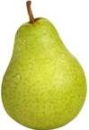 2 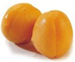 3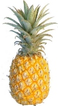 4 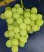

  

  

Verticales:

5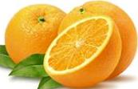 6  7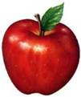 8  9 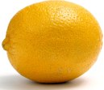

  

  

10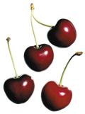 11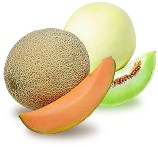 12 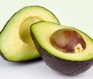 13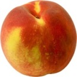 14

  

2.**Escribe el nombre de las hortalizas de cada serie**

la zanahoria

los espárragos

el hinojo

la rucola

los pimientos

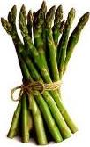 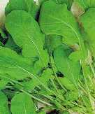 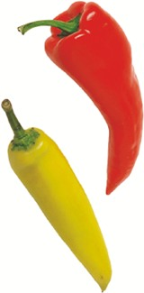 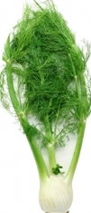 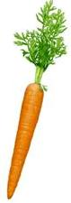

la patata

el maíz

el tomate

los pepinos

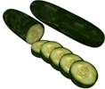 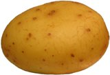 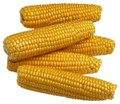 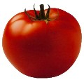

la col

las espinacas

la coliflor

la lechuga

  

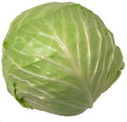 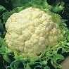 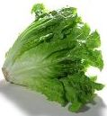 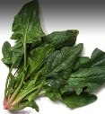

  

las judías verdes

las judías secas

los guisantes

las lentejas

  

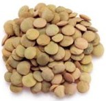 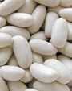 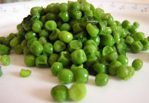 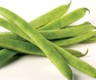

la cebolla

el ajo

el brécol

los calabacines

  

  

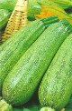 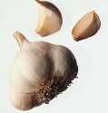 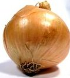 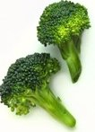

la berenjena

el perejil

las aceitunas

  

  

  

 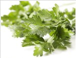 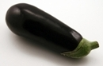

  

  

**3**. ¿Cuál de estas ensaladas te gusta más? ¿Por qué?

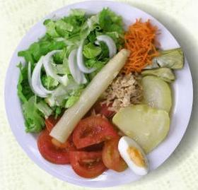 Ensalada mixta   
|  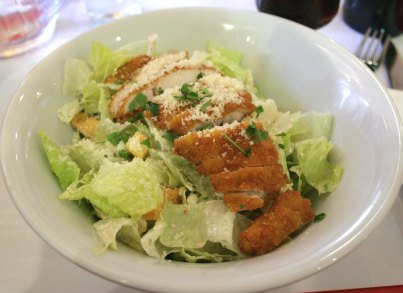 Ensalada César   
  
---|---  
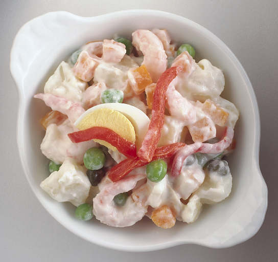 Ensaladilla rusa   
|  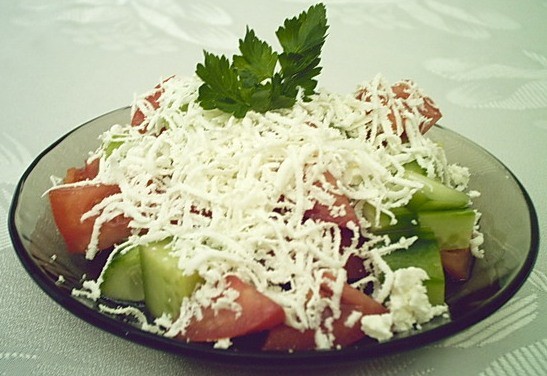 Ensalada shopska   
  
  
  

  

  

4\. Habla con tu compañero

  

  * ¿Cuáles son tus frutas preferidas?

  * ¿Qué verduras te gustan más?

  * ¿Cuál es la ensalada más extraña que has comido?

  * ¿Qué frutas se comen en tu país?

  * ¿Qué ensalada se come más en tu familia?

  

  

5\. Piensa en tus ensaladas favoritas: una de verduras y otra de frutas. ¿Qué ingredientes llevan? Haz una lista de los productos y cantidades (kilos, gramos) que necesitas para prepararlas e invitar a todo el grupo a tu casa.

  

Ejemplo: **ensalada Snezhanka para 12 personas** : 

  

Pepinos – un kilo

Yogur – 6 envases

Aceite – 2 cucharadas

Hinojo – 2 manojos

Ajo – 8 dientes

Nueces – 150 gramos

Sal – al gusto

  

  

  

  

  

  

  

  

  

6\. Ve a la frutería de tu compañero y compra los productos. 

Ejemplo:

  * Buenos días, Manolo, ¿qué te pongo?

  * Ponme dos kilos de patatas.

  * Aquí tienes. ¿Algo más?

  * Sí, quería también 2 ajos y 10 ramilletes de hinojo.

  * Aquí los tienes. ¿Algo más?

  * Nada más, gracias. ¿Cuánto es?

  * Son 7,80.

  * Aquí tienes.

  

  

  

  

**A. Pon un título a cada fotografía.**

  

S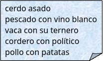 erie 1

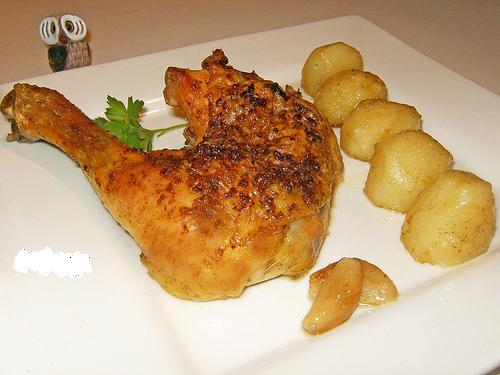 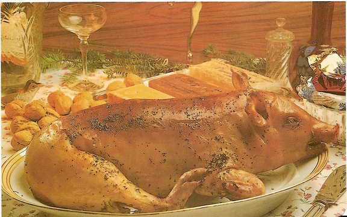

  

 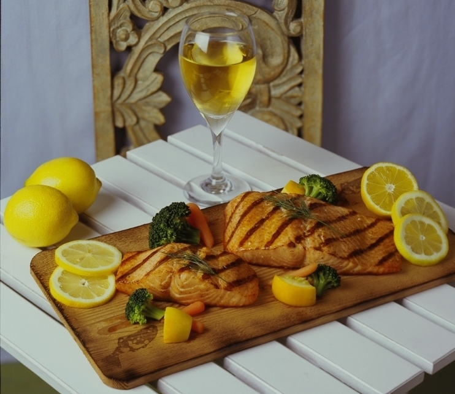 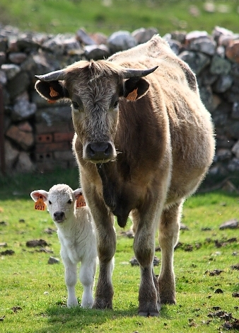

  

  

Serie 2

  

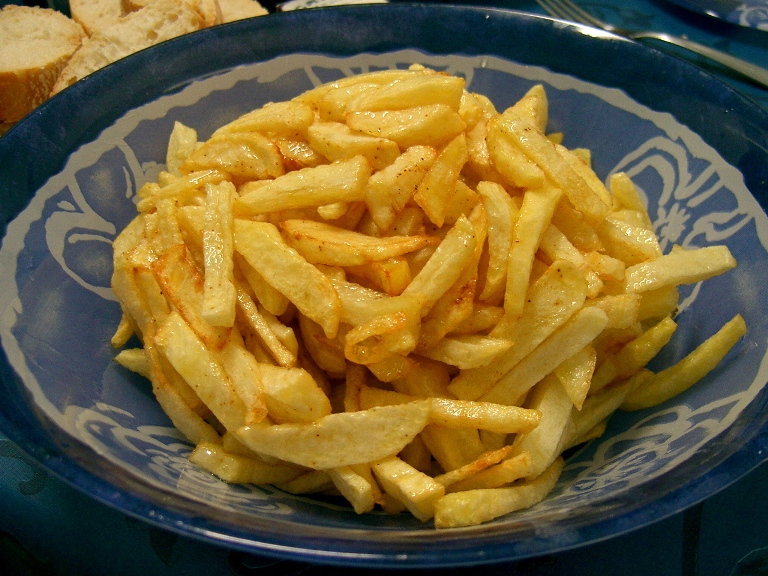 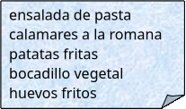 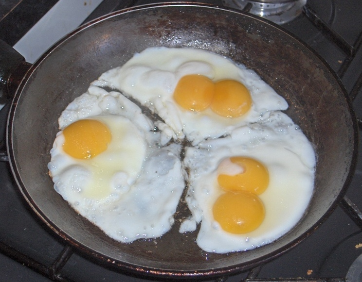

  

  

  

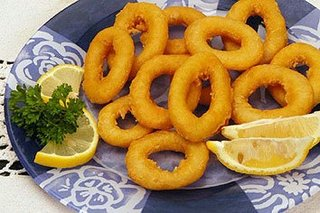 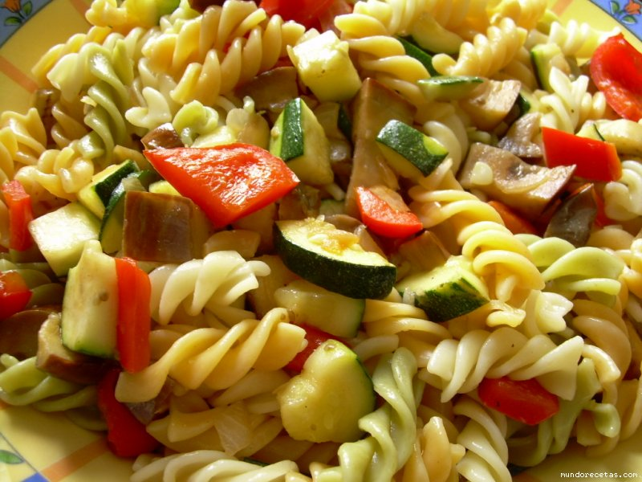 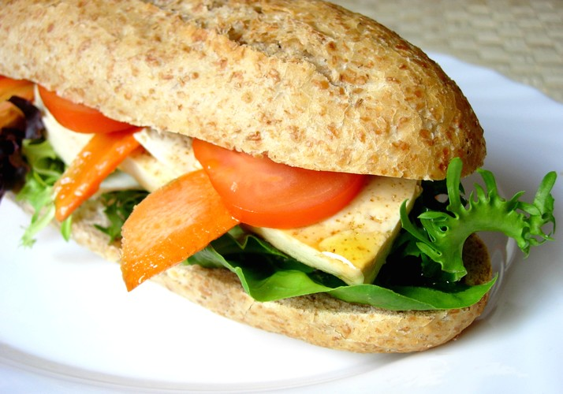

  

S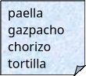 erie 3  PLATOS ESPAÑOLES

  

 

  

  

  

 

  

  

Serie 4 POSTRES

  

  

  

 

